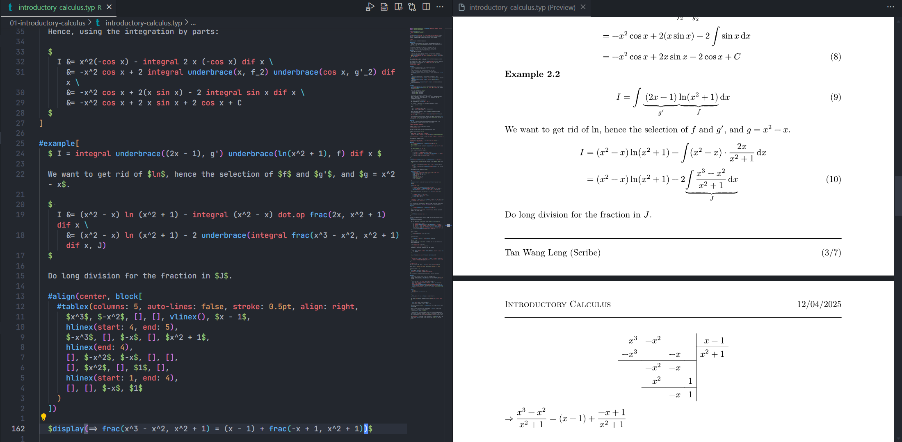

# typst-demo

This is my repo that tries to demonstrate the capabilities of [Typst](https://github.com/typst/typst).

## What is typst?

According to their README:

> Typst is a new markup-based typesetting system that is designed to be as powerful as LaTeX while being much easier to learn and use.

Typst is written in Rust.

As it is relatively young, the ecosystem is not as mature as LaTeX, and there may still be some features that are unrefined or missing. However, it is already usable for most common use cases that we will present in the showcases.

## Showcases

### 01 - Introductory Calculus

This is a basic demo of the capabilities of Typst. The notes are similar to what a student would scribe for an intro calculus course, which does not require fancy typesettings.

Not surprisingly, Typst has the ability to typeset math content. We also have basic features and packages similar to LaTeX's equivalent, such as the package `noteworthy` which provides a basic note-taking format and provides theorems and theorem-like labels.

Most of the content in this demo showcases the relative ease of using Typst with its cleaner syntax.

### Others

Coming soon...
